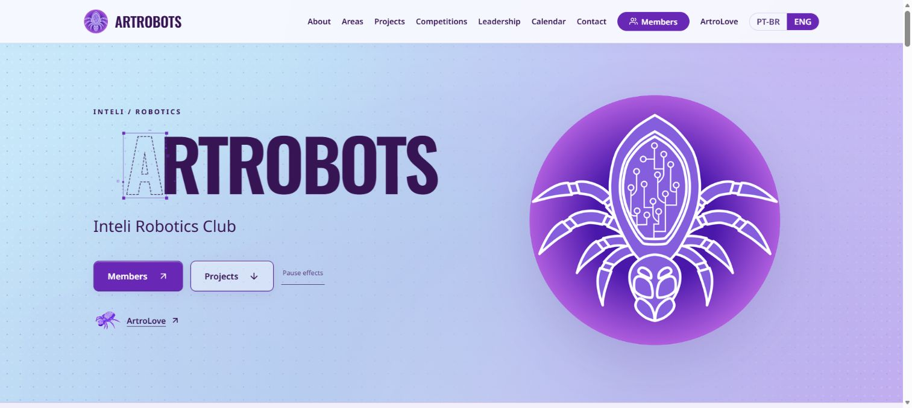

# Migração React e TypeScript

## Escopo e resultado local

As seis páginas PT/EN foram refatoradas para componentes React/TSX, mantendo o design e os endereços publicados. Base visual: `12b5ac6`; base Git: `b1357b7`. O conteúdo institucional é pré-renderizado e hidratado; membros e marketing são atualizados pelas APIs públicas da ArtroLove.

## Evidências reproduzíveis

| Verificação | Resultado |
| --- | --- |
| `npm test` | 40 testes, seis arquivos, aprovados |
| `npm run typecheck` | Aprovado |
| `npm run build` | Seis páginas pré-renderizadas; artefato público verificado |
| `npm audit --omit=dev` | Zero vulnerabilidades |
| API real de marketing | HTTP 200, 11 itens: quatro projetos, duas competições, três parcerias e dois eventos |
| API real de membros | HTTP 200, zero perfis aprovados; preservados 27 membros do acervo público legado |
| Navegador desktop | Home e diretório PT/EN; perfis individuais e troca de idioma preservando identidade; sem erros de hidratação, imagens quebradas ou transbordamento horizontal |
| Interações | Flip card por Enter/Escape com retorno de foco, carrossel, oito cards de liderança com brilho, seis canvases, menu móvel e fechamento por Escape |
| Celular | Diretório em 390 × 844, 27 cards e sem transbordamento horizontal |

Build validado: JS 345,43 kB (105,27 kB gzip), CSS 48,36 kB (10,44 kB gzip). As bibliotecas Canvas/WebGL continuam em JavaScript com interface tipada e ciclo de vida React; não são declaradas como uma reescrita integral em TypeScript.

## Comparação visual

Capturas reais do navegador no mesmo tamanho. Antes: domínio publicado. Depois: build de produção React local em `127.0.0.1:3123`. Não são montagens nem evidência de deploy.

| Antes | Depois |
| --- | --- |
|  |  |

## Limites e próxima integração

O cadastro importado da planilha permanece privado. A API pública atual só retorna perfis revisados. A ponte por ID estável entre cadastro e perfil público, com seleção e aprovação de campos, depende do checkpoint do backend. Testes sintéticos de projetos, retirada e permissões não equivalem à aprovação institucional de pessoas reais. Esta entrega não publica linhas da planilha automaticamente.

O formulário de contato não possuía serviço de envio na versão anterior. A refatoração informa esse estado e direciona aos contatos existentes; não simula envio bem-sucedido.

## Publicação comprovada

- Código publicado: `cdfeded8f7eadca7b44df6c7babcffacc5c01afc`, [PR 3](https://github.com/Artrobots-Inteli/Site-2026/pull/3).
- CI aprovado no SHA exato: [push](https://github.com/Artrobots-Inteli/Site-2026/actions/runs/36354545900) e [pull request](https://github.com/Artrobots-Inteli/Site-2026/actions/runs/36354565607).
- Render: serviço existente `srv-das2cnojo6nc739uabeg`, deploy `dep-dasparbbc2fs7389gscg`, publicado em 27/09/2026 às 19h15, UTC−3. Build executou tipos, Vite e verificação das seis páginas.
- Smoke em https://artrobots.tech/: seis rotas HTTP 200, todas carregando `/_app/main-CYh054wa.js`, idêntico ao build validado.
- Navegador publicado: home EN em 1528 × 686, seis canvases, oito cards de liderança, conteúdo CMS carregado, sem imagens quebradas ou transbordamento. Diretório PT: 27 cards e 27 links de perfis, sem erro de console no navegador integrado.
- O Edge registrou três mensagens de canal assíncrono de extensão; não foram reproduzidas no navegador integrado. Não houve erro de hidratação React observado.

A revisão independente também verificou 226 referências locais e 90 âncoras sem falhas. Reversão disponível pelo deploy anterior `12b5ac60b15fdd3a56d5f5467aa40e0e24338433`. Nenhuma migração de dados foi necessária para esta refatoração do site.
