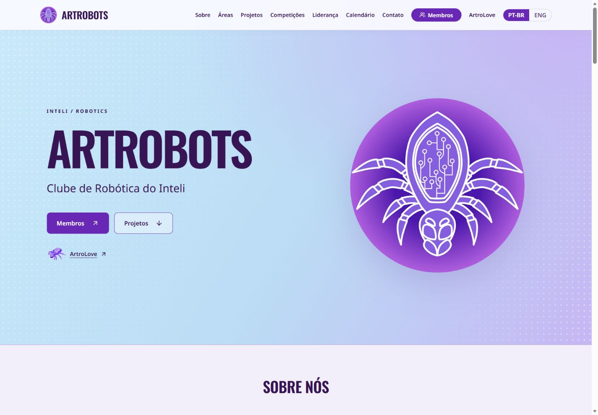
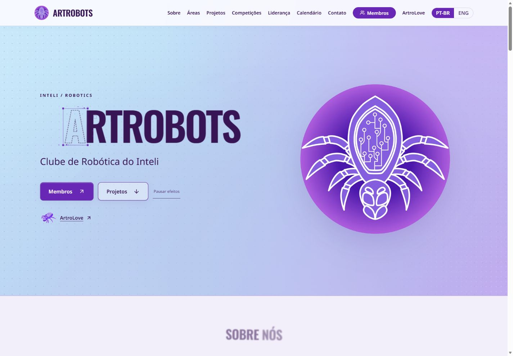

# Artrobots: antes e depois dos efeitos

Capturas reais do site publicado em 27/09/2026. Versão final `12b5ac60b15fdd3a56d5f5467aa40e0e24338433`, [PR 2](https://github.com/Artrobots-Inteli/Site-2026/pull/2), [CI aprovado](https://github.com/Artrobots-Inteli/Site-2026/actions/runs/36308233695), [deploy concluído](https://dashboard.render.com/static/srv-das2cnojo6nc739uabeg/deploys/dep-dasdqb17lnhs738ou020).

[Abrir site](https://artrobots.tech/) · [Mapa dos nove efeitos e validação](../../reactbits-publicado.md)

| Tela | Antes | Depois |
|---|---|---|
| Abertura desktop | [Captura](antes/artrobots-desktop.png) | [Captura](depois/artrobots-desktop.png) |
| Abertura celular | [Captura](antes/artrobots-mobile.png) | [Captura](depois/artrobots-mobile.png) |
| Página completa desktop | [Captura](antes/artrobots-completa-desktop.png) | [Captura](depois/artrobots-completa-desktop.png) |
| Página completa celular | [Captura](antes/artrobots-completa-mobile.png) | [Captura](depois/artrobots-completa-mobile.png) |
| Membros desktop | [Captura](antes/membros-desktop.png) | [Captura](depois/membros-desktop.png) |
| Membros celular | [Captura](antes/membros-mobile.png) | [Captura](depois/membros-mobile.png) |

## Abertura

### Antes

### Depois

## Interação

[FlipCard aberto em desktop](depois/flipcard-desktop.png) · [FlipCard aberto no celular](depois/flipcard-mobile.png)

As capturas de página completa foram obtidas com o botão **Pausar efeitos** ativado, deixando os textos ScrollReveal legíveis fora da área visível. As demais mostram efeitos ativos. Imagens estáticas não demonstram movimento, reflexos ou resposta ao ponteiro. Os arquivos originais não foram transformados; dimensões, formato real e hashes estão em `antes/manifest.json` e `depois/manifest.json`.

Verificação publicada: 4 projetos, 2 competições, 3 parceiros e 2 eventos sincronizados em PT/EN; 8 imagens acessíveis; nenhum overflow horizontal em 390 px. Os cards mantêm foco e estado durante atualização. Conteúdo editorial anterior, incluindo contatos e nomes, continua sujeito à revisão do clube.
