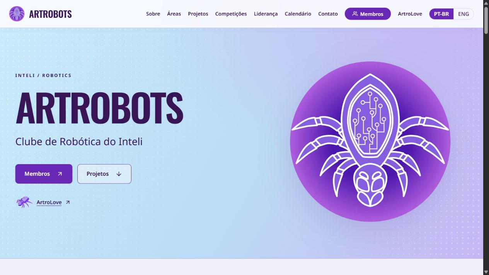

# Restauração da landing page

A navegação espacial com mapa 3D foi retirada porque a experiência visual não atendeu ao resultado solicitado. A landing anterior foi restaurada, mantendo navegação por seções, diretório de membros, perfis conectados à ArtroLove e disponibilidade de 10h às18h.

A reversão preserva o histórico Git e devolve os arquivos de aplicação à revisão9efb817. O commit08f344f reverte integralmente a experiência introduzida em b6239b3. Em produção, o Render restaurou o artefato5a0b18d no deploy dep-dascl7u0tbcc73erdc20, confirmado Live em27/09/2026. O comando de build voltou a `node deploy/build.cjs`.

Build e nove testes do diretório/perfis passaram. O domínio https://artrobots.tech foi conferido no navegador com a landing anterior, sem a cena Three.js. A API editorial e o painel de marketing continuam na ArtroLove; a landing restaurada ainda usa seus conteúdos institucionais anteriores, sem consumir esse novo feed.

